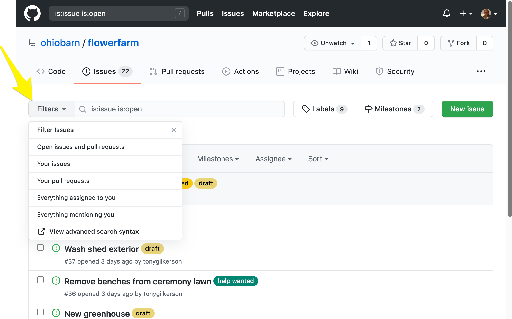

# Issues

[Github issues](https://github.com/ohiobarn/flowerfarm/issues) are used to manage tasks and activities for all crew members. 

## Becoming a project member

Before you can participate on issues you need to perform a one-time setup and join the `ohiobarn/flowerfarm` project.  You  will receive an invitation in your email inbox. The invitation will contain a link that you can use to join the `ohiobarn/flowerfarm` issues list. Click the link and join and start reviewing the list of issues. 

## Issue List

This OBFF issue list is a tool you will use each week to plan and coordinate on specific issues. The goal is for you to plan out your work week, select the issues you want to work on then coordinate with me using the issue list tool to complete each issue as described.

The [issue UI](https://github.com/ohiobarn/flowerfarm/issues?q=is%3Aissue+is%3Aopen) us intuitive, you should be able to discover/learn many of its features with just a little time using the tool. Below are a few common functions that you will want to learn:

* **Filters**: The issues search bar allows you to define your own custom filters and sort by a wide variety of criteria. For example, often you will want to search for open issues with the "help wanted" label. For this search you will use the following filter `is:issue is:open label:"help wanted"`, [click here](https://github.com/ohiobarn/flowerfarm/issues?q=is%3Aissue+is%3Aopen+label%3A%22help+wanted%22) to see this search filter used.

* **Milestones**: A milestone is used to track a project as part of a larger goal.  A milestone is a set of related issues and each milestone marks a major project function. For example, the "build new green house" project might have several milestones like *planning*, *purchase supplies*, *prepare site* and *bend poles* and *assemble greenhouse*. And each of those milestones will be made up of several issues. The [milestone UI](https://github.com/ohiobarn/flowerfarm/milestones) is primarily a tool for OBFF planning. As a crew member you many not need to the milestone UI that often, however if you are woking issues that are part of a milestone this UI will be useful for you to understand the priority the issue. 

## Workflow

A workflow is the process you will follow to find, work on and complete issues.

The following will step you through the a common workflow for finding, working and completing issues:

1. Review the [open issues](https://github.com/ohiobarn/flowerfarm/issues?q=is%3Aopen+is%3Aissue+no%3Aassignee+label%3A%22help+wanted%22). You are looking for issues labeled `help wanted`.
1. Read the issue and if you have questions add a comment and ask for clarification and then apply the `question` label to the issue.
1. Once you find an issue that you can work on, either you have no questions or a previous questions was sufficiently answered, remove the `question` label, if one exists, and assign yourself to the issue.
1. Assigning yourself to an issue marks the end of the planning phase. Next you will enter the execution phase where you will actually work on the issue. There may be some time between the end of planning and when you actually start working on an issue. For example, you may pickup a painting issue but wait for several weeks for good weather before you actually start work.  Therefore, we need a way to signal when you plan to work on an issue.
1. Apply the `next` label to issues that you plan to work on during your next work day visit. If you don't have a set schedule then please indicate in the issue comments the date of your next visit.
1. When you are finished  with  the issue simply click the `close issue` button

> **Note** - I encourage you to use the issue comments to have a discussion at any time during the workflow. Simply mentioning `@tonygilkerson` in the comment and I will respond on the issue.  This is expected during the planning phase but even when you  are working a issue, it might take you several visit, and new questions may arise. If the question is small the mention is all that is needed, however, if the question is blocking or you don't have supplies apply the `blocked` label.

Workflow summary:

1. Review the [open issues](https://github.com/ohiobarn/flowerfarm/issues?q=is%3Aopen+is%3Aissue+no%3Aassignee+label%3A%22help+wanted%22)
1. Ask questions and apply the `question` label
1. Once you find an issue you want to work on and have no more questions, assign the issue to yourself.
1. When the time comes that you plan to work on an issue during your next visit, apply the `next` label
1. If you get stuck apply the `blocked` label
1. When done click the `close issue` button
