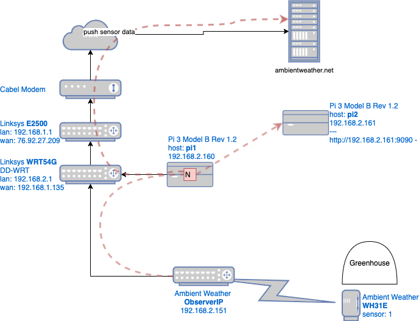
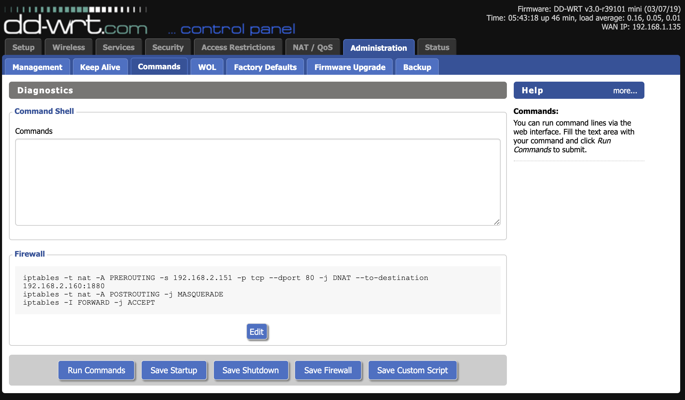

# Greenhouse IOT 

## Overview



The drawing above shows how the sensor data emanating from *ObserverIP* is intercepted via `iptables` running on *WRT54G* and sent to a Node-RED service running on `pi1`

## Router Setup

You will need to find an old WAP like the Linksys *WRT54G*, and load **DD-WRT**
### iptables

This section based on this [blog post](https://obrienlabs.net/redirecting-weather-station-data-from-observerip/)

An *iptables* entry is created to intercept traffic from *ObserverIP* to *ambientweather.net* and redirect it Node-RED running on a Raspberry Pi. The *gh-flow* service, hosted by Node-RED on `pi1`, will act as a tee, sending the data to Prometheus before sending it along to its original target *ambientweather.net*.

```bash
#
# ssh to WRT54G
#
ssh root@192.168.2.1 

#
# While on pi1
# redirect traffic from ObserverIP to pi1
#
iptables -t nat -A PREROUTING -s 192.168.2.151 -p tcp --dport 80 -j DNAT --to-destination 192.168.2.160:1880
iptables -t nat -A POSTROUTING -j MASQUERADE

# Allow everything to be forwarded through the router (simple but do not use on routers directly connected to the internet)
iptables -I FORWARD -j ACCEPT

# Verify
iptables -t nat -L PREROUTING

# Save above as Firewall script to survive a reboot
```

**Note** to survive a reboot the above commands need to be saved in a Firewall script (see [dd-wrt iptables doc](https://wiki.dd-wrt.com/wiki/index.php/Iptables_command))



## Pi Setup

Load raspbian lite OS and then set a static IP. For more information see the official [Raspberry Pi Doc](https://www.raspberrypi.org/documentation/configuration/tcpip/)

### raspi-config

Login with the default login `pi/raspbery` and run `rasp-config`

```bash
raspi-config
```

* Change the password for the `pi` user
* Change the hostname to `pi1` and `pi2`
* Enable ssh under "Interface Options"

This will allow for `ssh pi@192.168.2.161`

### Static IP address

Configure the `eth0` interface statically by editing the `/etc/dhcpcd.conf` file.

For the hostname `pi1`:

```bash
interface eth0
static ip_address=192.168.2.160/24
static routers=192.168.2.1
static domain_name_servers=192.168.2.1 8.8.8.8
```

For the hostname `pi2`:

```bash
interface eth0
static ip_address=192.168.2.161/24
static routers=192.168.2.1
static domain_name_servers=192.168.2.1 8.8.8.8
```

## Prometheus

The following is based on this [article](https://pimylifeup.com/raspberry-pi-prometheus/).

```bash
sudo apt update
sudo apt full-upgrade

wget https://github.com/prometheus/prometheus/releases/download/v2.22.0/prometheus-2.22.0.linux-armv7.tar.gz
tar xfz prometheus-2.22.0.linux-armv7.tar.gz
mv prometheus-2.22.0.linux-armv7/ prometheus/
rm prometheus-2.22.0.linux-armv7.tar.gz
```

Create a service config file

```bash
sudo nano /etc/systemd/system/prometheus.service
```

and edit to look like the following.

```text
[Unit]
Description=Prometheus Server
Documentation=https://prometheus.io/docs/introduction/overview/
After=network-online.target

[Service]
User=pi
Restart=on-failure

ExecStart=/home/pi/prometheus/prometheus \
  --config.file=/home/pi/prometheus/prometheus.yml \
  --storage.tsdb.path=/home/pi/prometheus/data

[Install]
WantedBy=multi-user.target
```

Then

```bash
sudo systemctl enable prometheus
sudo systemctl start prometheus
sudo systemctl status prometheus

open http://192.168.2.161:9090
```

## Push Gateway

This section base on this [github page](https://github.com/prometheus/pushgateway/blob/master/README.md)

```bash
wget https://github.com/prometheus/pushgateway/releases/download/v1.4.0/pushgateway-1.4.0.linux-armv7.tar.gz


tar xfz pushgateway-1.4.0.linux-armv7.tar.gz
mv pushgateway-1.4.0.linux-armv7/ pushgateway/
rm pushgateway-1.4.0.linux-armv7.tar.gz
```

Create a service config file

```bash
sudo nano /etc/systemd/system/pushgateway.service
```

and edit to look like the following.

```text
[Unit]
Description=Prometheus Push Gateway
Documentation=https://prometheus.io/docs/introduction/overview/
After=network-online.target

[Service]
User=pi
Restart=on-failure

ExecStart=/home/pi/pushgateway/pushgateway

[Install]
WantedBy=multi-user.target
```

Then

```bash
sudo systemctl enable pushgateway
sudo systemctl start pushgateway
sudo systemctl status pushgateway
```


The query API allows accessing pushed metrics and build and runtime information.

```bash
curl -X GET http://192.168.2.161:9091/api/v1/status | jq
```

To configure pushgateway as a scrape target in prometheus edit `/home/pi/prometheus/prometheus.yml` as shown below (must have correct indentation)

```yaml
...
scrape_configs:
  ...
  - job_name: 'pushgateway'
    honor_labels: true
    static_configs:
    - targets: ['localhost:9091']
...
```

Then restart

```
sudo systemctl restart prometheus
```

## Alert Manager

Setup.

```bash
wget https://github.com/prometheus/alertmanager/releases/download/v0.21.0/alertmanager-0.21.0.linux-armv7.tar.gz
tar xfz alertmanager-0.21.0.linux-armv7.tar.gz
mv alertmanager-0.21.0.linux-armv7/ alertmanager/
rm alertmanager-0.21.0.linux-armv7.tar.gz
```

Create a service config file

```bash
sudo vi /etc/systemd/system/alertmanager.service
```

and edit to look like the following.

```text
[Unit]
Description=Alert Manager
Wants=network-online.target
After=network-online.target

[Service]
Type=simple
User=pi
Group=pi
ExecStart=/home/pi/alertmanager/alertmanager \
  --config.file=/home/pi/alertmanager/alertmanager.yml \
  --storage.path=/home/pi/alertmanager/data/alertmanager

Restart=always

[Install]
WantedBy=multi-user.target
```

Configure the alertmanager config

```bash
sudo nano /home/pi/alertmanager/alertmanager.yml
```

and edit to look like the following. See the [alertmanager config doc](https://prometheus.io/docs/alerting/latest/configuration/).  And here is a good [blog](https://grafana.com/blog/2020/02/25/step-by-step-guide-to-setting-up-prometheus-alertmanager-with-slack-pagerduty-and-gmail/)

```text
global:
  # URL value not shown becaue it contains a token
  # to get the URL in slack, click more > apps > Browse Apps > Custom Integrations > Incoming WebHooks
  # or go here: https://bagelwarehouse.slack.com/services/1874015307842
  slack_api_url: 'https://hooks.slack.com/services/REDACTED/REDACTED/REDACTED'

route:
  receiver: 'slack-notifications'
  group_by: [alertname, datacenter, app]

receivers:
- name: 'slack-notifications'
  slack_configs:
  - channel: '#weather-alerts'
    send_resolved: true
    text: Detail *Temp* `{{ .CommonAnnotations.description }}` {{ range .Alerts -}}{{ range .Labels.SortedPairs }}  *{{ .Name }}* `{{ .Value }}`{{ end }}{{ end }}
```

Then

```bash
sudo systemctl enable alertmanager
sudo systemctl start alertmanager
sudo systemctl status alertmanager

open http://192.168.2.161:9093
``` 

Now go to the Prometheus server directory and add to the prometheus.yml file and add stuff like this:

```yaml
alerting:  
  alert managers:  
    - static_configs: 
       - targets:  
           - "localhost:9093  
rule_files:  
 - "./rules.yml"
```

And make the `rules.yml` look like:

```yaml
groups:
- name: sensors
  rules:
  - alert: gh-very-cold
    expr: round(avg_over_time(obff_wh31e_temp1f [2m])) < 50
    annotations:
      text: 'Greenhouse is very cold'
      description: "{{ $value }}"
  - alert: gh-cold
    expr: round(avg_over_time(obff_wh31e_temp1f [2m])) < 59
    annotations:
      text: Greenhouse is cold
      description: "{{ $value }}"
  - alert: gh-warm
    expr: round(avg_over_time(obff_wh31e_temp1f [2m])) > 75
    annotations:
      text: Greenhouse is warm
      description: "{{ $value }}"
  - alert: gh-hot
    expr: round(avg_over_time(obff_wh31e_temp1f [2m])) > 85
    annotations:
      text: Greenhouse is hot
      description: "{{ $value }}"
  - alert: gh-very-hot
    expr: round(avg_over_time(obff_wh31e_temp1f [2m])) > 90
    annotations:
      text: Greenhouse is very hot
      description: "{{ $value }}"
```

If changes are made to the file you need to restart to have them take affect:

```bash
vi rules.yml 
sudo systemctl restart prometheus
sudo systemctl status prometheus
sudo journalctl --unit=prometheus -f
```

to debug:

```bash
sudo journalctl --unit=alertmanager.service
```

## Grafana

This section is based on this [article](https://grafana.com/tutorials/install-grafana-on-raspberry-pi/)


Installing grafana on `pi2`

```bash
# Add the APT key used to authenticate packages:
wget -q -O - https://packages.grafana.com/gpg.key | sudo apt-key add -

# Add the Grafana APT repository:
echo "deb https://packages.grafana.com/oss/deb stable main" | sudo tee -a /etc/apt/sources.list.d/grafana.list

# install grafana
sudo apt-get update
sudo apt-get install -y grafana
```

Edit the config

```bash
vi /etc/grafana/grafana.ini

# set the following
[auth]
disable_login_form = true
...

[auth.anonymous]
# enable anonymous access 
enabled = true

...

# specify organization name that should be used for unauthenticated users
org_name = Ohio Barn Flower Farm


# specify role for unauthenticated users
org_role = Editor
```

then.

```bash
sudo /bin/systemctl enable grafana-server
sudo /bin/systemctl start grafana-server
sudo /bin/systemctl status grafana-server
```

Open a browser and go to http://192.168.2.161:3000. Log in to Grafana with the default username `admin`, and the default password `admin`. Change the password for the admin user when asked.

## Metrics

### obff_wh31e_temp1f

The `gh-flow` will generate a metric similar to the following.

```bash
cat <<EOF | curl --data-binary @- http://192.168.2.161:9091/metrics/job/sensor_reading/location/greenhouse
# TYPE obff_wh31e_temp1f gauge
# HELP obff_wh31e_temp1f Greenhouse Tempature
obff_wh31e_temp1f 60.25
```

* **Metric Name**: obff_wh31e_temp1f
* **Labels**:
  * job=sensor_reading
  * location=greenhouse

## Miscellaneous

### Static Routs

This section based on [this](https://wiki.dd-wrt.com/wiki/index.php/Linking_Subnets_with_Static_Routes)

on router 1


### Bug fix

Do this on pi1 and pi2

```bash
sudo vi /etc/avahi/avahi-daemon.conf

# Comment out
# use-ipv6=yes

# set this
deny-interfaces=wlan0

# Then
sudo systemctl restart avahi-daemon
```
