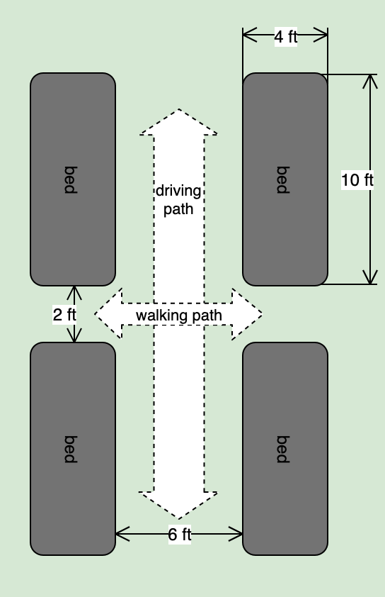

# Spring 2020 Plan

## Flower Field Layout

### Bed Spacing

* Each bed is 4 feed by 10 feet
* The beds are arranged in grid
* There is 6ft between each row
    * This leaves room for driving equipement up and down the row, i.e. the gator
* There is a 2ft space between each bed in a row
    * This provides a walking path so you can cut accros the rows when you are on foot
    * Allows one to easily reach into the center and harvest from any point

>Each bed is 4x10 feet

 

### Plant Spacing

Doing the math, each bed is 48 inches (4 feet) wide and 120 inches (10 feet) long, as shown above, and by planting with 9-inch square spacing, I can fit 65 plants in each bed:

* **width**: 48in / 9in spacing = 5.3 plants; rounds down to 5 plants
* **length**: 120in / 9in spacing = 13.3 plants; rounds down to 13 plants
* **bed**: 5 plants X 13 plants = 65 plants per bed

>65 plants per bed

### Field Overview

Here is an overview of the field.

