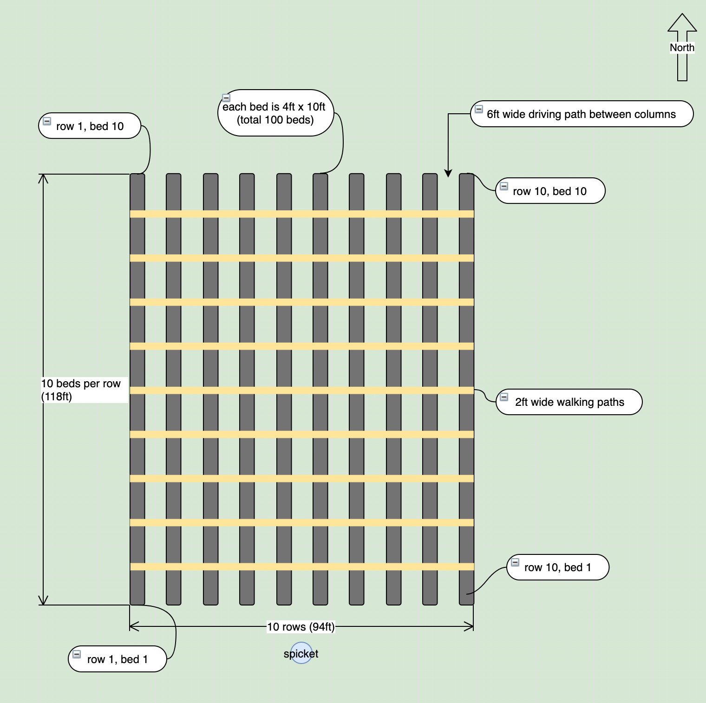
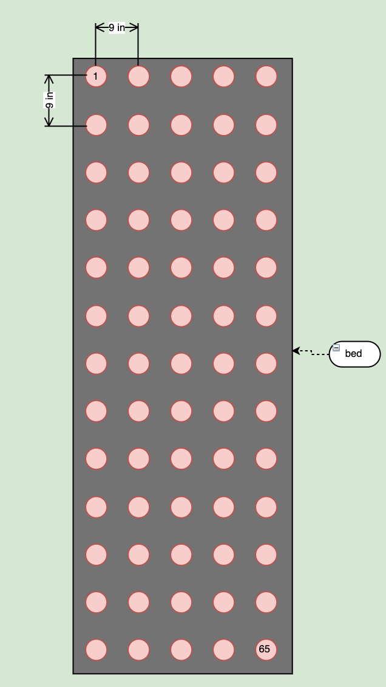
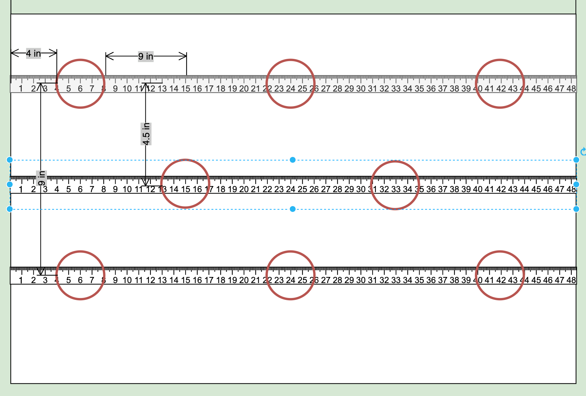
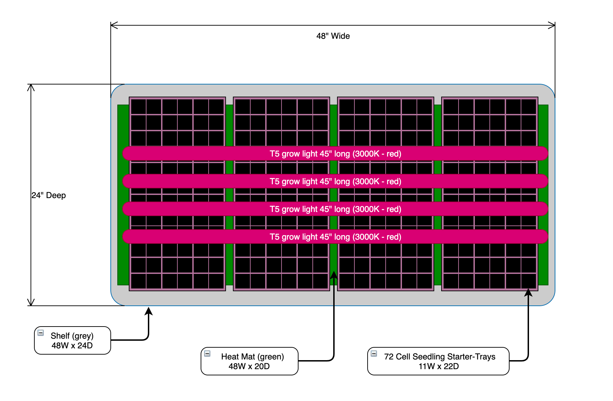
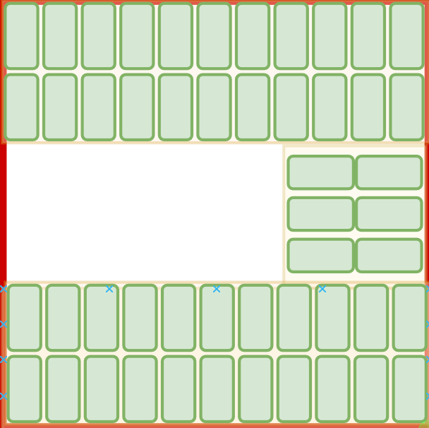
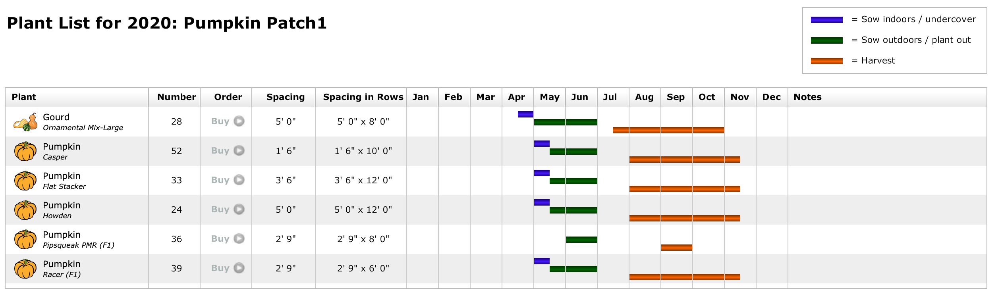
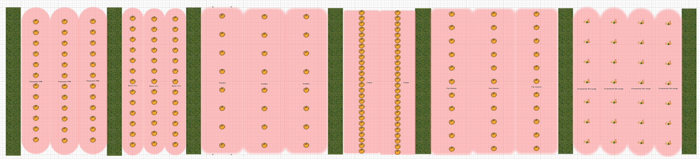
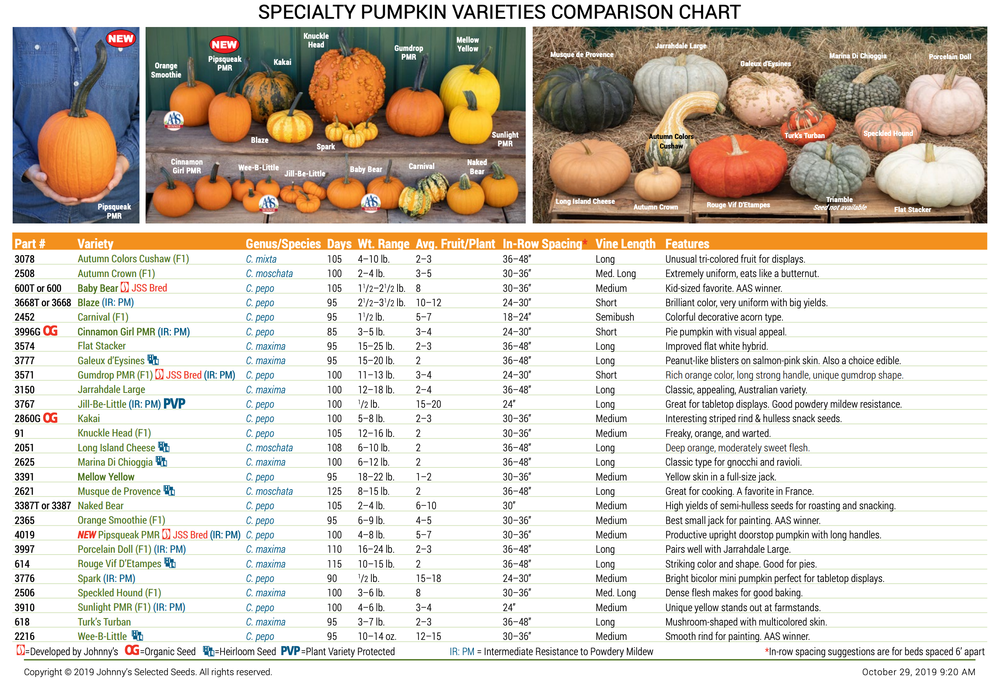

# Spring 2020

## Results

* [Germ to buy list](https://airtable.com/shrCgcllsvxiaqQhT) - This is the AirTable with the list of seeds to buy for each variety

## Quick Facts

> * Fairborn, OH is in Zone 6a.
> * On average, your frost-free growing season starts Apr 11 and ends Oct 30, totaling 202 days
> * Spring 2020 in Northern Hemisphere will begin on Thursday, March 19

---

## Flower Field Layout

Reference:

* [dripworks planning guide](https://www.dripworks.com/resources/drip-planning-guide)
* [growing with landscape fabric](https://www.floretflowers.com/growing-with-landscape-fabric/)



* Each bed is 4 feet by 100 feet
* 10 beds total (5 beds in each irrigation zone)
* 2 feet between each bed with 6 feet between each zone 
  * Landscape fabric is 6 feet wide. This is enough to cover the beds and overlap in between to allow ~2 feet for a walking path
* 3 drip tape irrigation lines per bed
* 2 irrigation zones, each zone has 15 drip tape lines

---

## Spacing Plan

To compute the number of plants per bed; each bed is 48 inches (4 feet) wide and 1,200 inches (100 feet) long, as shown above, and by planting with 9-inch spacing, I can fit ~665 plants in each bed:

* **Plants per width**: 48in / 9in spacing = 5.3 plants; rounds down to 5 plants
* **Plants per length**: 1200in / 9in spacing = 133.3 plants; rounds down to 133 plants 
* **Plants per bed**: 5 plants X 133 plants = 665 plants per bed

>665 plants per bed, that's 6,650 plants for the entire field



### Spacing Template



---

## Irrigation Setup

### Flow

Knowing your flow rate is critical to sizing your system. 

I did a flow test with the spigot out in the field.  It took about 55 seconds to fill 5 gallon bucket. I used the following formula to compute gallons per hour (GPH). Or you can use the [flow calculator](https://www.dripworks.com/resources/calculators/flow-estimator) from dripworks.com

```text
5 gal    60 sec   60 min   18,000 gal
------ x ------ x ------ = ---------- ~=  327 GPH
55 sec    1 min    1 hr       55 hr

```

> Flow Capacity:  **327 GPH**

> To provide your lawn with one inch of water takes a little over half a gallon per square foot (0.623 gallon to be more exact). That means that every 10’x10’ area will require over 62 gallons of water. 


For one 80x4 bed it takes about 200 gal to provide 1" of water.

```
.623 Gal    (80ft x 4 ft bed)
--------- x ----------------- = 199.36 ~ 200 gal
  1sq ft
```

Using the [drip-tape-estimator](https://www.dripworks.com/resources/calculators/drip-tape-estimator) given 3 beds with 4 drip lines per bed on 80 feet long bed using **8mill 8" low flow tape** I get **Total water required:** of `192 GPH`.  I am not sure if I understand correctly but that is about the 200 gal from above so I think it will take:
 
>about 1 hour for 1" of water


### Soil Type

Next we need to know our soil type:

* Clay - requires a 0.5 GPH emitter
* Loam - requires a 0.5-1 GPH emitter
* Sand - requires a 1-2 GPH emitter 

In my case I am not sure, I will guess loam for now.

>**Loam** - requires a 0.5-1 GPH emitter (let's go with 0.75 GPH)

### Product Selection

According to the description Drip Tape sounds best for my situation:

>**Drip Tape** is best for long, straight row crops. It is the most economical way to water your plants and is easy to install and maintain.

To start I am going to buy a kit. There seems to be two kits that could do the job:

* [drip tape row crop medium](https://www.dripworks.com/drip-tape-row-crop-kit-medium)
* [drip tape row crop large](https://www.dripworks.com/drip-tape-row-crop-kit-large)

If I only use two strips of drip tape per row then I could get the medium kit.  However, the medium kit leaves no room for error and I feel like 9 inch spacing for the plants is denser than normal so I better go with at least three strips of drip tape per row.  Given that I will get the large kit with an extra timer so I can automate two zones.

In [this blog post](https://www.floretflowers.com/soil-preparation/) Floret says they use four strips of drip tape per four foot bed but they have sandy soil and even say that you could get by with two or three strips if you don't have sandy soil, so that validates my choice.  

> I will be going with the [drip tape row crop large kit](https://www.dripworks.com/drip-tape-row-crop-kit-large)

### Zones

The drip tape that comes with the [large kit](https://www.dripworks.com/drip-tape-row-crop-kit-large) uses [drip tape part# TA1508L](https://www.dripworks.com/aqua-traxx-15-mil-drip-tape-rolls) which is rated at **Flow per 100 feet is 20 GPH**. So that is 20 GPH for each strip of drip tape. I need 30 strips total for the field which would require 600 GPH (20 GPH X 30 strips), but my system can only generate 327 GPH. Therefore, if I split my field into two zone, 5 beds requiring 15 strips each, then each zone will only need 300 GPH (20 GPH X 15 strips) which is less than 327 GPH, so we are good.

> two zones, each requiring 300 GPH (20 GPH X 15 strips)

---

## Germination Station

### Shelf Layout

The image below shows the layout for one shelf of the germination station. Each shelf will be able to hold `288 plants`, four starter trays of 72 plants each.  

> 288 plants per shelf



### Station

Each station is a five shelf unit.  The top shelf is used for storage and four shelves will be used for germination.  Each station will be able to hold `1,152 plants`, four shelves of 288 plants each.

> 1,152 plants per station

### Greenhouse Tray  Layout



---

## Beds Summary

* Main cutting beds
* Filler and Foliage
* Sunflower strip
* Pumpkin patch

### Garden Planner

Main cutting beds, annuals with irrigation.

> * [Bed Layout PDF](Main-Field-2020.pdf)
> * [Sow Grow Chart PDF](Main-Field-2020-Plant-List.pdf)

## Spacing

| #| Plant               | Propagation | Start   | Between plants in row   | Between rows | Rows per bed | Fabric | Irrigation |
|--|---------------------|-------------|---------|-------------------------|--------------|--------------|--------|------------|
| 1| Dahlias             | tuber       | outside | 16 in                   | 16 in        | 3            |  yes   |   yes      |
| 2| Dahlia Mix          | seed        | inside  | 12 in                   | 16 in        | 3            |  yes   |   yes      |
| 3| Ranunculus          | corms       | outside |  8 in                   | 10 in        | 4            |   no   |   yes      |  
| 4| Anemone             | corms       | outside |  6 in                   | 10 in        | 4            |   no   |   yes      |
| 5| Cosmos              | seed        | inside  |  9 in                   |  9 in        | 5            |  yes   |   yes      |
| 6| Larkspur            | | |
| 7| Zinnias             | seed        | inside  |  9 in                   |  9 in        | 5            |  yes   |   yes      |
| 8| Black Eyed Susans   | seed        | inside  |  9 in                   |  9 in        | 5            |  yes   |   yes      |
| 9| Snapdragon          | seed        | inside  |  9 in                   |  9 in        | 5            |  yes   |   yes      |
| 9| Stocks              | | |
|10| Celosia             | | |
|11| Gormphrena          | | |
|12| Marigold            | | |
|13| Choc.Qn Anne's Lace | | |
|14| Sweet Pea           | | |

## Varieties

In this table if the number of plants is fixed then the *bed-linear-feed* will be computed in the Garden Planner app.  However in most cases the *bed-linear-feed* is given and the number of plans is computed. **Note** a "plant" might require several seeds (or tubers or corms) if it is a "thinning" plant like the pumpkins or if you need to sow several seeds per plant.

| Plant              | Variety                     | Row Group | Fixed        | Derived   | Sow per plant | Stock&#8224;| What to Buy (stock * 1.2)
|--------------------|-----------------------------|-----------|--------------|-----------|---------------|-------------|--------------------------
| Dahlias            | Jan Ryecroft (Sm 4”)        |  6A       |   5 tubers   |  9 LBF    |  1 tuber      |   5 tubers  |   5 tubers
|                    | Lady Natalie (Sm 4”)        |  6A       |   5 tubers   |  9 LBF    |  1 tuber      |   5 tubers  |   5 tubers
|                    | Golden Scepter (Sm 2”)      |  6A       |   5 tubers   |  9 LBF    |  1 tuber      |   5 tubers  |   5 tubers
|                    | Black Satin (Sm 2-4”)       |  6B       |   5 tubers   |  9 LBF    |  1 tuber      |   5 tubers  |   5 tubers
|                    | Cornel (Sm 4”)              |  6B       |   5 tubers   |  9 LBF    |  1 tuber      |   5 tubers  |   5 tubers
|                    | Dorothy (Sm)                |  6B       |   5 tubers   |  9 LBF    |  1 tuber      |   5 tubers  |   5 tubers
|                    | Franz Kafka (Sm 2-3”)       |  6C       |   7 tubers   |  8 LBF    |  1 tuber      |   7 tubers  |   7 tubers
|                    | Wizard of Oz (Sm 3”)        |  6C       |   3 tubers   |  8 LBF    |  1 tuber      |   3 tubers  |   3 tubers
|                    | Peaches n Cream (Med 4-6“)  |  6D       |   8 tubers   | 12.5 LBF  |  1 tuber      |   8 tubers  |   8 tubers
|                    | Conn.Coral (Med)            |  6D       |   8 tubers   | 12.5 LBF  |  1 tuber      |   8 tubers  |   8 tubers
|                    | Mystique (Med 4-6“)         |  6D       |   8 tubers   | 12.5 LBF  |  1 tuber      |   8 tubers  |   8 tubers
|                    | BoomBoom White (Med 6”)     |  6E       |   5 tubers   |  9 LBF    |  1 tuber      |   5 tubers  |   5 tubers
|                    | Sweet Nathalie (Med. 5”)    |  6E       |   5 tubers   |  9 LBF    |  1 tuber      |   5 tubers  |   5 tubers
|                    | Lancresse (Med 4-6“)        |  6E       |   5 tubers   |  9 LBF    |  1 tuber      |   5 tubers  |   5 tubers
|                    | Thomas Edison (Med 6”)      |  6F       |   5 tubers   |  9 LBF    |  1 tuber      |   5 tubers  |   5 tubers
|                    | Shiloh Noelle (XL 10”)      |  6F       |   5 tubers   |  9 LBF    |  1 tuber      |   5 tubers  |   5 tubers
|                    | Hamari Gold (XL 10”)        |  6F       |   5 tubers   |  9 LBF    |  1 tuber      |   5 tubers  |   5 tubers
|                    | Penhill Watermelon (XL 10”) |  6G       |   8 tubers   | 12 LBF    |  1 tuber      |   8 tubers  |   8 tubers
|                    | Otto’s Thrill (XL)          |  6G       |   8 tubers   | 12 LBF    |  1 tuber      |   8 tubers  |   8 tubers
|                    | Café Au Lait (XL)           |  6G       |   8 tubers   | 12 LBF    |  1 tuber      |   8 tubers  |   8 tubers
|                    | Mix (seed)                  |  6H       |  30 LBF      | 90 plants |  2 seeds      | 180 seeds   | 216 seeds
| Cosmos             | Versailles Mix              |  7A       |   6 LBF      | 40 plants |  1 seed       |  40 seeds   |  48 seeds
|                    | Dbl-Click SnowPuff          |  7B       |   6 LBF      | 40 plants |  1 seed       |  40 seeds   |  48 seeds
|                    | Dbl-Click Mix               |  7C       |   6 LBF      | 40 plants |  1 seed       |  40 seeds   |  48 seeds
|                    | Rubenza                     |  7D       |   6 LBF      | 40 plants |  1 seed       |  40 seeds   |  48 seeds
|                    | Sea Shells                  |  7E       |   6 LBF      | 40 plants |  1 seed       |  40 seeds   |  48 seeds
| Zinnias            | Jazzy Mix                   |  7F       | 6.5 LBF      | 45 plants |  6 seeds      | 270 seeds   | 324 seeds
|                    | Oklahoma White              |  7G       | 6.5 LBF      | 45 plants |  6 seeds      | 270 seeds   | 324 seeds
|                    | Queen Red Lime              |  7H       | 6.5 LBF      | 45 plants |  6 seeds      | 270 seeds   | 324 seeds
|                    | Giant Mix                   |  7I       | 6.5 LBF      | 45 plants |  6 seeds      | 270 seeds   | 324 seeds
|                    | Giant Salmon Rose           |  7J       | 6.5 LBF      | 45 plants |  6 seeds      | 270 seeds   | 324 seeds
|                    | Uproar Rose                 |  7K       | 6.5 LBF      | 45 plants |  6 seeds      | 270 seeds   | 324 seeds
| Snapdragons        | Potomac Custom Mix          |  8A       |  10 LBF      | 65 plants |  1 seed       |  65 seeds   |  78 seeds  
|                    | Rocket Mix                  |  8B       |  10 LBF      | 65 plants |  1 seed       |  65 seeds   |  78 seeds
|                    | Costa Silver                |  8C       |  10 LBF      | 65 plants |  1 seed       |  65 seeds   |  78 seeds
|                    | Madame Butterfly Mix        |  8D       |  10 LBF      | 65 plants |  1 seed       |  65 seeds   |  78 seeds
|                    | Costa Mix                   |  8E       |  10 LBF      | 65 plants |  1 seed       |  65 seeds   |  78 seeds
| Black-Eyed Susans  | Triloba                     |  8F       |12.5 LBF      | 85 plants |  1 seed       |  85 seeds   | 102 seeds
| (Cornflower)       | Hirta Cherokee Sunset Mix   |  8G       |12.5 LBF      | 85 plants |  1 seed       |  85 seeds   | 102 seeds
|                    | Hirta Indian Summer         |  8H       |12.5 LBF      | 85 plants |  1 seed       |  85 seeds   | 102 seeds
|                    | Hirta Cherry Brandy         |  9I       |12.5 LBF      | 85 plants |  1 seed       |  85 seeds   | 102 seeds
| Anemone            | DeCaen White                | 10A       |  10 LBF      | 80 plants |  1 root       |  80 roots   |  80 roots
|                    | DeCaen Blue White Mix       | 10B       |   5 LBF      | 40 plants |  1 root       |  40 roots   |  40 roots
|                    | Lord Lieutenant             | 10C       |   4 LBF      | 32 plants |  1 root       |  32 roots   |  32 roots
|                    | Super Mix                   | 10D       |   6 LBF      | 48 plants |  1 root       |  48 roots   |  48 roots
| Ranunculus         | Romantic Mix                | 10E       |  12 LBF      | 72 plants |  1 root       |  72 roots   |  72 roots
|                    | Red                         | 10F       |   6 LBF      | 36 plants |  1 root       |  36 roots   |  36 roots
|                    | White                       | 10G       |  12 LBF      | 72 plants |  1 root       |  72 roots   |  72 roots
|                    | Bridal Mix                  | 10H       |  18 LBF      |108 plants |  1 root       | 108 roots   | 108 roots
|                    | Violet                      | 10I       |   3 LBF      | 16 plants |  1 root       |  16 roots   |  16 roots
|                    | Purple/ White Picotee       | 10J       |   9 LBF      | 52 plants |  1 root       |  52 roots   |  52 roots
|                    | Pink/ White                 | 10K       |  12 LBF      | 72 plants |  1 root       |  72 roots   |  72 roots


> *  &#8224; Stock is exactly what is needed gut when growing from seed, always order 20 percent more. The `What to Buy` has 20% added to stock in some cases
> * `lbf` - linear bed feed.  The number of plants in a LBF depends on spacing, for example with a 9in x 9in, 6 LBF will hold about 40 plants.

---

## Filler and Foliage

Floret said 50% Foliage and filler

### Filler

| #| Plant          | | |
|--|----------------|-|-|
| 1| Baby's Breath (Gypsophila) | | |
| 2| Bishops Flower | | |
| 3| Love-in-a-Mist | | |

### Foliage

| #| Plant            | | |
|--|------------------|-|-|
| 1| Dusty Miller     | | perennials but grown as annual|
| 2| Scented Geranium | | |
| 3| Grasses-Panicum  | | "frosted explosion" |
| 4| Eucalyptus       | | "silver drop", "seeded" |

---

## Sunflowers

Sunflower beds, no irrigation

| #| Variety             | | |
|--|------------------|-|-|
| 1| Single bloom | | |
| 2| Blush | | |

---

## Pumpkin Patch

Pumpkin Patch, no irrigation

|#| Variety        | Size   | Days to Maturity | Vine Length | Between plants in row | Between rows | Grow    | Link  |
|-|----------------|--------|------------------|-------------|-----------------------|--------------|---------|-------|
|1| PipSqueak      | Small  | 100              | Medium      | 33 in                 |  8 ft        | &#8224; | [JS](https://www.johnnyseeds.com/vegetables/pumpkins/pipsqueak-pmr-f1-pumpkin-seed-4019.html?cgid=pumpkins)
|2| Racer Treated  | Medium |  85              | Short       | 33 in                 |  6 ft        | &#8224; | [JS](https://www.johnnyseeds.com/vegetables/pumpkins/jack-o-lanterns/racer-treated-f1-pumpkin-seed-2163T.html#q=racer&lang=en_US&start=1)
|3| Howden         | Large  | 115              | Long        | 60 in                 | 12 ft        | &#8224; | [JS](https://www.johnnyseeds.com/vegetables/pumpkins/specialty-pumpkins/casperita-f1-pumpkin-seed-3076.html#q=casperita&lang=en_US&start=1)
|4| Casperita      | Mini   |  77              | Medium      | 18 in                 | 10 ft        | &#8224; | [JS](https://www.johnnyseeds.com/vegetables/pumpkins/specialty-pumpkins/casperita-f1-pumpkin-seed-3076.html#q=casperita&lang=en_US&start=1)
|5| Flat Stacker   | Medium |  95              | Long        | 42 in                 | 12 ft        | &#8224; | [JS](https://www.johnnyseeds.com/vegetables/pumpkins/specialty-pumpkins/flat-stacker-f1-pumpkin-seed-3574.html)
|6| Ornamental Mix | Gourd  |  95              | Medium      | 60 in                 |  8 ft        | &#8224; | [JS](https://www.johnnyseeds.com/vegetables/gourds/ornamental-gourds-small-mixed-gourd-seed-604.html#q=ornamental%2Bgourds&lang=en_US&start=1)

> &#8224; - For direct seeding, sow 2 seeds per spacing, 1/2-1" deep. Thin to 1 plant per spacing after seedlings are established

### Pumpkin Field 



---



---



## Soil Test

Results:

* the results: [soil-test-results-S191028-111](soil-test-results-S191028-111.PDF)
* the request: [soil_test_routine_home_grounds_101019](soil_test_routine_home_grounds_101019.pdf)

Summary of the recommendation:

The numbers in this table represent **lbs/1000 sq ft**

| Nitrogen, N | Phosphorus, P2O5 | Potassium, K2O |
|:-----------:|:----------------:|:--------------:|
| 2-3         | 1                | 1
> For example 2.5 lbs/1000 sq ft of N

The main cutting field is 10 locations (4x100) each location 400 sq ft so that times 10 locations gives a total of 4,000 sq ft. 

> main cutting field `4,000 sq ft`
 N -  8 - 12 lbs  (4000/1000 * 2) - (4000/1000 * 3) 
 P -  4 lbs       (4000/1000 * 1)
 K -  4 lbs       (4000/1000 * 1)

To calculate how much fertilizer is needed using the following calculation. This formula can be calculated for N, P or K.

`Lbs. N recommended / %N in the fertilizer blend x 100 = lbs. fertilizer needed per 1000 sq ft` 

So `10-10-10` all purpose fertilizer is generally available at [THD](https://www.homedepot.com/p/Hyponex-40-lb-All-Purpose-Fertilizer-10-10-10-523902/202968725).  

Lets compute how much of the `10.10.10` is need for P and K, then I will need to supplement for N.

```text
# given a 40 lb bag of 10-10-10

40 lbs * 10% N = 4 lbs of N ( which is 4 to 8 lbs short of what we need)
40 lbs * 10% P = 4 lbs of P ( which is what we need)
40 lbs * 10% K = 4 lbs of K ( which is what we need)

```

N sourced from urea

To make up the shortfall of N let look at some [urea](https://www.amazon.com/Seed-And-Plant-Urea-Fertilizer/dp/B076B3961Y/ref=asc_df_B076B3961Y/?tag=hyprod-20&linkCode=df0&hvadid=309835941037&hvpos=&hvnetw=g&hvrand=16452409708629974501&hvpone=&hvptwo=&hvqmt=&hvdev=c&hvdvcmdl=&hvlocint=&hvlocphy=9015854&hvtargid=pla-569879295008&psc=1&tag=&ref=&adgrpid=60867042199&hvpone=&hvptwo=&hvadid=309835941037&hvpos=&hvnetw=g&hvrand=16452409708629974501&hvqmt=&hvdev=c&hvdvcmdl=&hvlocint=&hvlocphy=9015854&hvtargid=pla-569879295008) which is rated at `45-0-0`

```text
# given a 4 lb bag of 45-0-0

4 lbs * 45% N = 1.8 lbs of N per bag 

Therefore we would need 4 bags which has 7.2 lbs of N ( 7.2 = 4 * 1.8). This is in the 4 to 8 lbs shortfall range.

```
