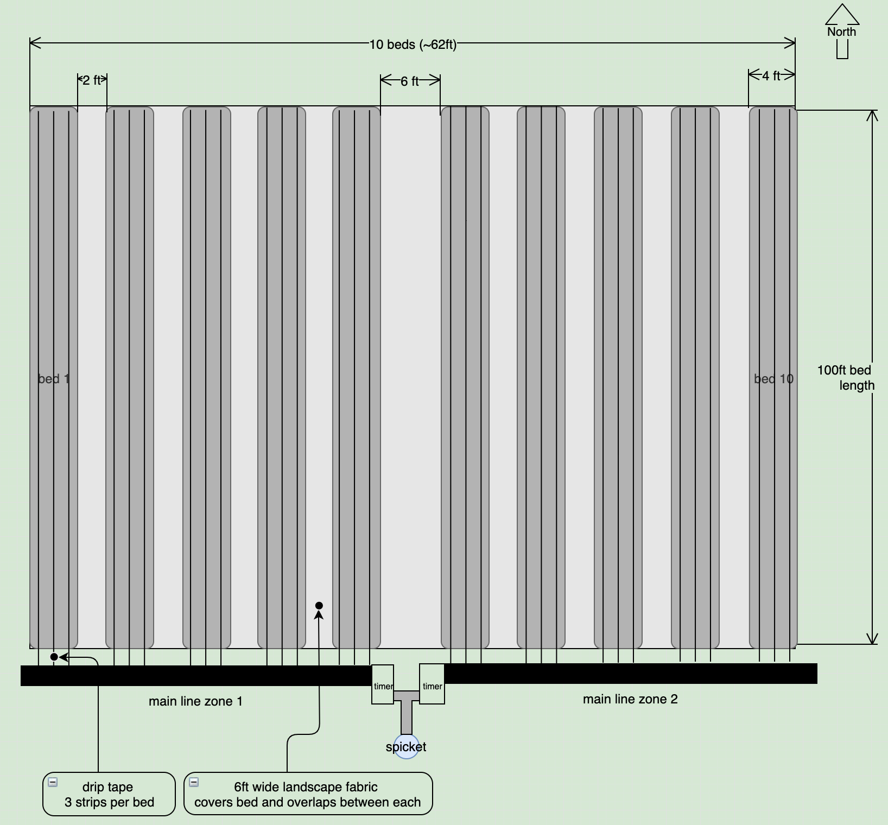

# Spring 2020 Plan

## Flower Field Layout

Here is an overview of the field.



* Each row is 4 feet by 100 feet
* There is 6ft between each row. This leaves room for driving equipment up and down the row, i.e. the gator
* Each row has three drip tape irrigation lines
* Two irrigation zones, each zone has 15 drip tape lines to cover 5 rows each zone

Doing the math, each bed is 48 inches (4 feet) wide and 1200 inches (100 feet) long, as shown above, and by planting with 9-inch square spacing, I can fit 65 plants in each bed:

* **width**: 48in / 9in spacing = 5.3 plants; rounds down to 5 plants
* **length**: 1200in / 9in spacing = 133.3 plants; rounds down to 133 plants 
* **bed**: 5 plants X 133 plants = 665 plants per row

>665 plants per row


## Irrigation

Reference for this section:

* [dripworks planning guide](https://www.dripworks.com/resources/drip-planning-guide)

### Flow

Knowing your flow rate is critical to sizing your system. 

I did a flow test with the spigot out in the field.  It took about 55 seconds to fill 5 gallon bucket. I used the following formula to compute gallons per hour (GPH). Or you can use the [flow calculator](https://www.dripworks.com/resources/calculators/flow-estimator) from dripworks.com

```text
55 gal   60 sec   60 min   18,000 gal
------ x ------ x ------ = ---------- ~=  327 GPH
55 sec    1 min    1 hr       55 hr

```

> flow test: 55 seconds per 5 gallons
>
> that works out to **327 GPH**

### Soil Type

Next we need to know our soil type:

* Clay - requires a 0.5 GPH emitter
* Loam - requires a 0.5-1 GPH emitter
* Sand - requires a 1-2 GPH emitter 

In my case I am not sure, I will guess loam for now.

>**Loam** - requires a 0.5-1 GPH emitter (let's go with 0.75 GPH)

### Product Selection

According to the description Drip Tape sounds best for my situation:

>**Drip Tape** is best for long, straight row crops. It is the most economical way to water your plants and is easy to install and maintain.

To start I am going to buy a kit. There seem to be two kits that could do the job:

* [drip tape row crop medium](https://www.dripworks.com/drip-tape-row-crop-kit-medium)
* [drip tape row crop large](https://www.dripworks.com/drip-tape-row-crop-kit-large)

If I only use two strips of drip tape per row then I could get the medium kit.  However, the medium kit leaves no room for error and I feel like I am my 9in spacing for the plants is denser than normal so I better go with at least three strips of drip tape per row.  Given that I will get the large kit with an extra timer so I can automate two zones. 

> I will be going with the [drip tape row crop large kit](https://www.dripworks.com/drip-tape-row-crop-kit-large)

