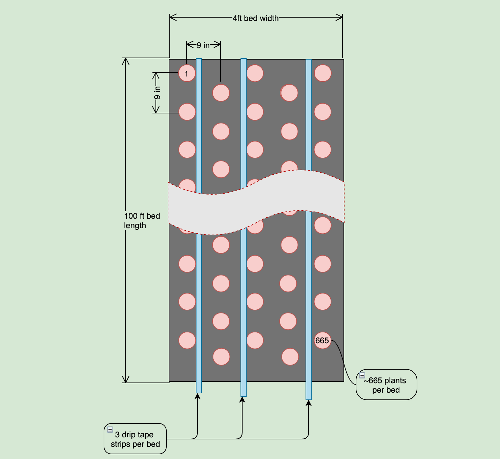

# Spring 2020 Plan

## Flower Field Layout


* Each bed is 4 feet by 100 feet
* 10 beds total (5 beds in each irrigation zone)
* 2 feet between each bed with 6 feet between each zone 
  * Landscape fabric is 6 feet wide. This is enough to cover the beds and overlap in between to allow ~2 feet for a walking path
* 3 drip tape irrigation lines per bed
* 2 irrigation zones, each zone has 15 drip tape lines

## Plant Spacing

To compute the number of plants per bed; each bed is 48 inches (4 feet) wide and 1,200 inches (100 feet) long, as shown above, and by planting with 9-inch spacing, I can fit ~665 plants in each bed:

* **Plants per width**: 48in / 9in spacing = 5.3 plants; rounds down to 5 plants
* **Plants per length**: 1200in / 9in spacing = 133.3 plants; rounds down to 133 plants 
* **Plants per bed**: 5 plants X 133 plants = 665 plants per bed

>665 plants per bed, that's 6,650 plants for the entire field



## Irrigation

### Flow

Knowing your flow rate is critical to sizing your system. 

I did a flow test with the spigot out in the field.  It took about 55 seconds to fill 5 gallon bucket. I used the following formula to compute gallons per hour (GPH). Or you can use the [flow calculator](https://www.dripworks.com/resources/calculators/flow-estimator) from dripworks.com

```text
55 gal   60 sec   60 min   18,000 gal
------ x ------ x ------ = ---------- ~=  327 GPH
55 sec    1 min    1 hr       55 hr

```

> Flow Capacity:  **327 GPH**

### Soil Type

Next we need to know our soil type:

* Clay - requires a 0.5 GPH emitter
* Loam - requires a 0.5-1 GPH emitter
* Sand - requires a 1-2 GPH emitter 

In my case I am not sure, I will guess loam for now.

>**Loam** - requires a 0.5-1 GPH emitter (let's go with 0.75 GPH)

### Product Selection

According to the description Drip Tape sounds best for my situation:

>**Drip Tape** is best for long, straight row crops. It is the most economical way to water your plants and is easy to install and maintain.

To start I am going to buy a kit. There seems to be two kits that could do the job:

* [drip tape row crop medium](https://www.dripworks.com/drip-tape-row-crop-kit-medium)
* [drip tape row crop large](https://www.dripworks.com/drip-tape-row-crop-kit-large)

If I only use two strips of drip tape per row then I could get the medium kit.  However, the medium kit leaves no room for error and I feel like 9 inch spacing for the plants is denser than normal so I better go with at least three strips of drip tape per row.  Given that I will get the large kit with an extra timer so I can automate two zones.

In [this blog post](https://www.floretflowers.com/soil-preparation/) Floret says they use four strips of drip tape per four foot bed but they have sandy soil and even say that you could get by with two or three strips if you don't have sandy soil, so that validates my choice.  


> I will be going with the [drip tape row crop large kit](https://www.dripworks.com/drip-tape-row-crop-kit-large)

### Zones

The drip tape that comes with the [large kit](https://www.dripworks.com/drip-tape-row-crop-kit-large) uses [drip tape part# TA1508L](https://www.dripworks.com/aqua-traxx-15-mil-drip-tape-rolls) which is rated at **Flow per 100 feet is 20 GPH**. So that is 20 GPH for each strip of drip tape. I need 30 strips total for the field which would require 600 GPH (20 GPH X 30 strips), but my system can only generate 327 GPH. Therefore, if I split my field into two zone, 5 beds requiring 15 strips each, then each zone will only need 300 GPH (20 GPH X 15 strips) which is less than 327 GPH, so we are good.

> two zones, each requiring 300 GPH (20 GPH X 15 strips)
 

Reference for this section:

* [dripworks planning guide](https://www.dripworks.com/resources/drip-planning-guide)
* [growing with landscape fabric](https://www.floretflowers.com/growing-with-landscape-fabric/)


