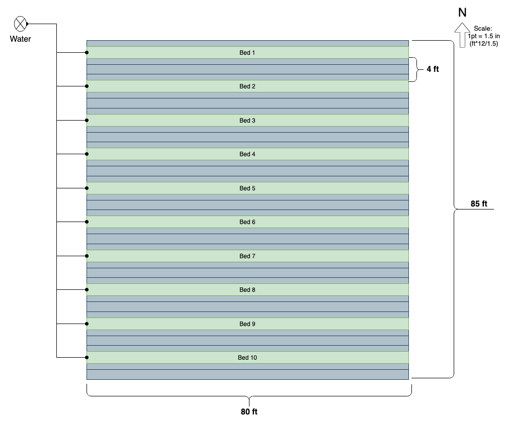
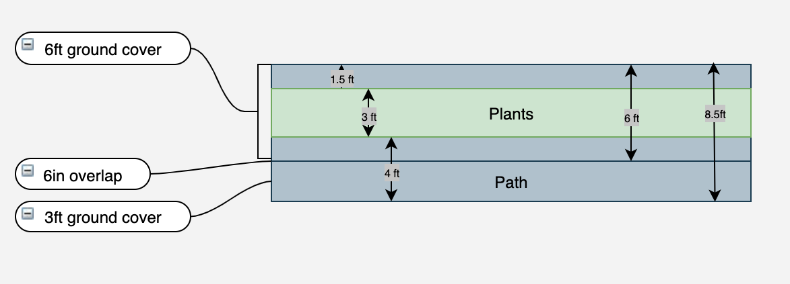

# Spring 2021

## Flower Field Layout

This year the beds will run East/West and have wider paths.

I plan to made the walking path wider. Last year I overlapped the 6ft ground cover which left about a 2ft path.  This is too small.  This year I plan to use an extra 3ft ground cover for a 4 ft path.

## Spacing Plan

see [2020 Spacing Plan](/spring2020/plan/#spacing-plan)

## Spacing Plan

see [2020 Spacing Plan](/spring2020/plan/#spacing-plan)

## Irrigation Setup

todo